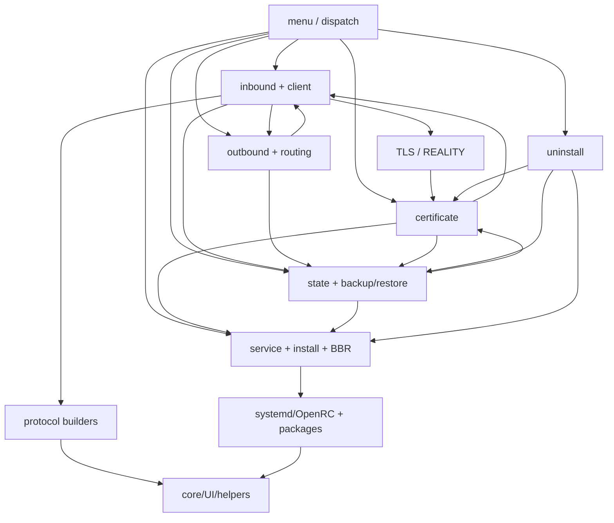

# xrayctl 架构审计（重构前基线）

审计基线：`d8b52dd`（`main`）  
审计日期：2026-08-11  
审计对象：仓库当前实际项目 `xrayctl`，不是需求文本中举例的 `sbctl/sing-box`。

## 1. 结论摘要

当前仓库不是“碎片模块 + source 覆盖”形态，而是另一种同样高成本的形态：

- systemd 版集中在 4,090 行的 `xrayctl.sh`。
- Alpine/OpenRC 版集中在 2,847 行的 `alpine/xrayctl.sh`。
- 两个入口没有互相 `source`，各自都是完整程序，但有 178 个同名函数的平行副本。
- 两个版本功能已经漂移：systemd 版有三级卸载、完整 Certbot/Cloudflare 生命周期和 metadata migration；Alpine 版有 OpenRC 安装和订阅输出，但状态、证书、卸载能力较旧。
- 单个文件同时承担 UI、配置事务、协议构造、证书、安装、服务、卸载和平台操作。函数间依赖只能通过全局命名空间和源码顺序理解。
- 单个 edition 内没有正式同名函数，也没有通过晚加载覆盖函数；主要重复发生在两个 edition 之间。
- `apply_candidate` 只事务化 `config.json`。入站 metadata 在配置提交之后单独写入，写 metadata 失败不会回滚配置。
- `restore_backup` 已经具备 config + metadata + certificates 的联合快照和失败回滚，是后续统一 state transaction 的最好行为基线。
- 静态扫描发现 11 个只出现于定义处的函数，属于高可信 dead code 候选。

本次重构必须保留仓库真实功能：VLESS、VMess、Trojan、SOCKS5、HTTP，RAW、XHTTP、WebSocket、gRPC，TLS、REALITY，以及 systemd/OpenRC。不会为了匹配策划示例而新增 Hysteria2、AnyTLS 或 sing-box 逻辑。

## 2. 当前模块表

| 文件 | 当前职责 | 调用哪些模块/外部能力 | 被哪些模块调用 | 职责是否混乱 | 建议归属 |
| --- | --- | --- | --- | --- | --- |
| `xrayctl.sh` | systemd 版完整程序：基础 UI、校验、网络探测、包安装、metadata、配置事务、Xray 安装、三级卸载、协议构造、入站/用户/出站、分享、证书、备份恢复、服务、BBR、菜单、CLI | `jq`、`curl`、`openssl`、`systemctl`、`journalctl`、`certbot`、包管理器、Xray CLI、文件系统 | `install.sh` 下载并执行；用户直接执行 | 是，4,090 行万能模块 | 拆入 `src/core.sh`、`platform.sh`、`state.sh`、`security.sh`、`certificate.sh`、`protocols.sh`、`inbound.sh`、`outbound.sh`、`share.sh`、`service.sh`、`uninstall.sh`、`menu.sh` |
| `alpine/xrayctl.sh` | Alpine/OpenRC 版完整程序；大部分业务复制自 systemd 版，另含 OpenRC 服务脚本、Xray release asset 安装、订阅输出和不同 Certbot 安装路径 | `jq`、`wget/curl`、`openssl`、`rc-service`、`rc-update`、`apk`、Xray CLI、文件系统 | `alpine/install.sh` 下载并执行；用户直接执行 | 是，2,847 行平行实现 | 公共业务合并到 `src/`；只保留 OpenRC/apk/Xray asset 差异在 `platform.sh`、`service.sh`、`certificate.sh` 的平台分支 |
| `install.sh` | systemd bootstrap：检查 Linux/root/curl，下载根单文件，安装并调用 `xrayctl install` | GitHub raw、`curl`、`install` | README 安装命令 | 较清晰，但 URL 固定到源码文件而非构建产物 | 只下载 `dist/xrayctl`，校验语法/哈希（发布流程可提供时），安装软链接并调用业务安装 |
| `alpine/install.sh` | Alpine bootstrap：使用 wget/curl 下载 Alpine 单文件并安装 | GitHub raw、`wget/curl`、`install` | Alpine README | 较清晰，但维护第二套发行物 | 合并为统一 `install.sh`，或暂保兼容包装器并下载同一个 `dist/xrayctl` |
| `README.md` | systemd 版功能、命令、路径、安全和安装说明 | 指向两个 installer | 用户 | 与 Alpine help/功能存在差异；未被自动核对 | 由 capability/help 测试约束，并说明统一发行物 |
| `alpine/README.md` | Alpine/OpenRC 专项说明 | 指向 Alpine installer | 用户 | 与主 README 形成第二份功能清单 | 收敛为主 README 的平台章节；保留兼容跳转页 |

## 3. 当前函数领域分布

### systemd 版 `xrayctl.sh`

| 行区间（重构前） | 实际职责 | 主要问题 |
| --- | --- | --- |
| 1–344 | 全局常量、日志、prompt、validator、网络探测、编码、随机值 | `core` 内混入公网探测和会修改 outbound 的 `_ensure_freedom_outbound` |
| 345–491 | OS/systemd 检查、包管理、依赖、锁、超时、NET_ADMIN | 平台接口不统一；业务仍大量直接调用 systemctl/包管理器 |
| 492–857 | metadata 初始化/migration、默认配置、candidate 校验和应用、入站 metadata | state 反向依赖 certificate parser、service/runtime access；config 与 metadata 不是同一事务 |
| 858–1,476 | 安装、权限、三级卸载和残留扫描 | service、platform、certificate、state、uninstall 混合 |
| 1,477–1,967 | 入站选择、TLS/REALITY prompt、stream/inbound builder、入站 CRUD | UI、security、protocol builder、state mutation 混合；`build_inbound` 是大型 dispatcher + 实现 |
| 1,968–2,215 | 配置编辑、日志级别、client CRUD | config state action 与 inbound client lifecycle 混合 |
| 2,216–2,356 | 分享链接 | 边界相对清晰，只读 config/meta |
| 2,357–3,236 | Certbot、Cloudflare、签发/导入/续期/删除、入站证书更新 | 最大单领域块；直接触及 state、systemd、credential 和 inbound |
| 3,237–3,319 | backup/restore | restore 已实现跨 config/meta/cert 联合回滚，应迁入 state |
| 3,320–3,526 | 服务、日志、BBR、诊断、首页摘要 | platform/service/UI 混合 |
| 3,527–3,712 | outbound 与 route assignment | 边界较清晰，但和 inbound 双向调用 |
| 3,713–4,038 | 各菜单和 help | help/capability 硬编码；菜单调用业务函数，整体方向正确 |
| 4,039–4,090 | CLI dispatch | 入口边界清晰，可迁入 menu/dispatch |

Alpine 文件的结构基本同构，但 metadata、certificate、uninstall 部分更旧；不能把它当作等价镜像机械保留。

## 4. 重复函数报告

### 4.1 单个发行版内

扫描规则：顶层 `name() {` 定义。

- `xrayctl.sh`：0 个重复函数名。
- `alpine/xrayctl.sh`：0 个重复函数名。
- 仓库中没有模块 `source`，因此不存在“后加载覆盖前实现”的当前行为。

### 4.2 两个发行版之间

共有 178 个同名函数。它们不是同一进程中的 override；最终生效实现由用户安装哪个 edition 决定：

- systemd 安装：`xrayctl.sh` 的实现生效。
- Alpine 安装：`alpine/xrayctl.sh` 的实现生效。

高风险重复如下：

| 函数 | systemd 定义 | Alpine 定义 | 当前实际生效实现 | 建议保留/合并方式 |
| --- | --- | --- | --- | --- |
| `apply_candidate` | `xrayctl.sh:804` | `alpine/xrayctl.sh:561` | 随 edition | 保留一份 state 实现，服务重启走 platform API |
| `restart_service` | `xrayctl.sh:793` | `alpine/xrayctl.sh:545` | 随 edition | 合并为 service API，systemd/OpenRC 差异下沉 platform |
| `install_or_update_xray` | `xrayctl.sh:924` | `alpine/xrayctl.sh:720` | 随 edition | 保留统一 service action；核心安装实现按平台路由 |
| `uninstall_xray` | `xrayctl.sh:1466` | `alpine/xrayctl.sh:777` | 随 edition | 以 systemd 三级模型和资源归属检查为基线，补 OpenRC resource cleanup |
| `build_stream_settings` | `xrayctl.sh:1639` | `alpine/xrayctl.sh:973` | 随 edition | 合并到 security/protocols 的唯一实现 |
| `build_inbound` | `xrayctl.sh:1699` | `alpine/xrayctl.sh:1033` | 随 edition | 拆协议 builder，保留轻量 dispatcher |
| `add_inbound` | `xrayctl.sh:1788` | `alpine/xrayctl.sh:1122` | 随 edition | 合并到 inbound，统一走 state transaction |
| `rename_inbound` | `xrayctl.sh:1861` | `alpine/xrayctl.sh:1195` | 随 edition | 合并到 inbound；config/meta 联合提交 |
| `add_client` | `xrayctl.sh:2079` | `alpine/xrayctl.sh:1413` | 随 edition | 合并到 inbound/client 公共 CRUD |
| `print_links` | `xrayctl.sh:2280` | `alpine/xrayctl.sh:1598` | 随 edition | 合并到只读 `share.sh` |
| `issue_certificate` | `xrayctl.sh:2793` | `alpine/xrayctl.sh:1852` | 随 edition，且能力不同 | 以 systemd 完整生命周期为主，保留 Alpine 可用的安装路径 |
| `restore_backup` | `xrayctl.sh:3251` | `alpine/xrayctl.sh:2055` | 随 edition | 以 systemd 联合回滚实现为基线并平台化 restart |
| `service_action` | `xrayctl.sh:3329` | `alpine/xrayctl.sh:2113` | 随 edition | 唯一 service API，底层走 platform |
| `add_outbound` | `xrayctl.sh:3598` | `alpine/xrayctl.sh:2383` | 随 edition | 合并到 outbound，统一 state transaction |
| `show_help` | `xrayctl.sh:3989` | `alpine/xrayctl.sh:2758` | 随 edition，文本已漂移 | 单一 help，平台差异动态显示 |
| `dispatch` | `xrayctl.sh:4039` | `alpine/xrayctl.sh:2803` | 随 edition，命令已漂移 | 单一 dispatch；注册统一 capability |

其余重复集中在以下组（组内函数均同时存在于两个 edition）：

- core/UI：`info warn error die heading clear_screen pause confirm choose prompt_* validate_* display_width print_table_* run_menu_action`。
- network/helpers：`detect_public_* detect_local_ips _freedom_tag_for_ip _ensure_freedom_outbound url_encode base64_nowrap random_* generate_uuid`。
- state/config：`ensure_config validate_candidate backup_config_quiet temp_file meta_* write_default_config`。
- inbound/client：`inbound_exists port_in_* prompt_* list/show/select/modify/delete_inbound client_*`。
- certificate/share：`certificate_* prompt_tls_certificate generate_reality_keys reality_public_key print_* import/list/delete_managed_certificate`。
- outbound/service/menu：`outbound_* service_* show_* manage_bbr system_diagnostics *_menu`。

重构后的 architecture test 将以 `src/` 全局函数名为作用域，任何正式同名定义直接失败。

## 5. 补丁链与兼容代码

### 5.1 override / guard / ext / enhancement / patch

- 没有 `*_guard.sh`、`*_ext.sh`、`*_fix.sh` 或动态 override 文件。
- 没有 `source` 语句；文件加载顺序当前不改变函数实现。
- 风险不是覆盖链，而是“两套完整源码的复制链”。同一个修复必须手工移植到 Alpine，否则行为继续漂移。
- metadata 区连续保留了两份“三层设计”标题注释，其中第二份带有 `P0-1 fix` 历史修复语义。这不是运行时代码，但说明补丁上下文已进入主源码，应在整理时改为稳定领域说明。

### 5.2 真正兼容逻辑

以下应保留并迁入 `state` migration：

- `migrate_legacy_certificates_v1`：扫描旧证书文件并补 metadata，带 migration marker，重复执行不重复注册。
- `cleanup_legacy_certbot_symlink_v1`：仅删除指向 xrayctl 自有 venv 的旧全局 symlink，带 migration marker。
- `_cleanup_legacy_resources`：卸载时处理旧资源；必须继续遵守“仅删除 xrayctl 自有资源”。

风险：`migration_done` 会先执行 `init_meta_base`，migration 再调用 raw helper。结构避免了递归，但 state 仍反向调用 `certificate_server_names`，应把“从证书文件取第一个 subject”的纯读取 helper 移到 security/certificate 并通过 migration adapter 调用，避免循环。

## 6. 实际依赖图

文件级没有循环，因为两个发行版都是单文件：

```text
README.md ──> install.sh ──download──> xrayctl.sh
alpine/README.md ──> alpine/install.sh ──download──> alpine/xrayctl.sh
```

函数领域级实际依赖如下（箭头表示调用）：



明确循环：

- `inbound ↔ outbound`：入站重命名检查 outbound 名称；outbound 选择/绑定调用 inbound 选择。
- `state ↔ certificate`：migration 解析证书；certificate metadata 和证书路径写入 state。
- `state ↔ service`：candidate commit 重启服务；安装/卸载和 runtime 权限又写 metadata。
- `certificate ↔ inbound`：证书更新会修改 TLS inbound；inbound 构造会调用证书选择。

这些循环被单文件隐藏。目标结构中将通过单向公共 API 解除：state 不感知 certificate 业务、state 只调用注入/统一的 service reload hook；certificate 通过 state candidate API 更新 inbound；outbound 读取 inbound selector/helper 而 inbound 不调用 outbound 内部实现。

## 7. Dead code 报告

静态规则：函数名在对应单文件中仅出现一次（定义本身）。下列 systemd 函数是高可信未调用代码：

| 函数 | 位置 | 判断 | 建议 |
| --- | --- | --- | --- |
| `json_quote` | `xrayctl.sh:332` | 仅定义 | 删除；所有 JSON 构造已用 jq |
| `apt_package_index_available` | `xrayctl.sh:384` | 仅定义 | 删除或由真实 dependency flow 调用；当前无价值 |
| `meta_mark_migration` | `xrayctl.sh:590` | 仅定义 | 删除 public wrapper，migration 内保留 raw helper |
| `meta_resource_get` | `xrayctl.sh:711` | 仅定义 | 删除；卸载使用 snapshot-safe 读取 |
| `get_service_user` | `xrayctl.sh:884` | 仅定义 | 删除；当前 runtime owner/group 来自常量 |
| `copy_certificate_pair` | `xrayctl.sh:912` | 仅定义 | 删除；真实路径使用 `replace_certificate_pair` / import flow |
| `safe_remove_file` | `xrayctl.sh:1025` | 仅定义 | 删除；managed file 删除有独立 helper |
| `meta_resource_get_existing` | `xrayctl.sh:1075` | 仅定义 | 删除；snapshot helper 已替代 |
| `set_log_level` | `xrayctl.sh:1982` | 仅定义 | README/help/menu 均无入口；删除历史残留 |
| `client_array_path` | `xrayctl.sh:1991` | 仅定义 | 删除；client CRUD 已直接按协议选择 jq path |
| `enable_bbr` | `xrayctl.sh:3431` | 仅定义 | 删除；`manage_bbr` 直接调用 `_enable_bbr` |

未发现空的 `_legacy_xxx_removed() { :; }` 函数，也未发现注释掉的大段旧实现。

注意：Bash 支持按字符串间接调用，静态结果会由新增测试配合 CLI/menu 覆盖复核后再删除；不在审计提交中直接删代码。

## 8. State mutation 清单

### 8.1 `config.json`

直接构造 candidate 并调用 `apply_candidate` 的业务函数：

- 入站：`add_inbound`、`rename_inbound`、`modify_inbound_basic`、`modify_inbound_transport`、`delete_inbound`。
- client：`add_client`、`delete_client`、`rotate_client_credential`、`rename_client`。
- config：`edit_config`、`set_log_level`。
- certificate/inbound：`update_tls_inbound_certificate`。
- outbound/routing：`_ensure_freedom_outbound`、`add_outbound`、`assign_outbound`、`delete_outbound`。

绕过普通 candidate transaction 的写入：

- `write_default_config`：首次创建，直接 heredoc 到生产路径。
- `restore_backup`：先覆盖 config/meta/certs，再联合验证；自身带 snapshot rollback。
- uninstall helpers：按卸载级别删除配置目录。

### 8.2 `meta.json`

直接写 metadata 的函数：

- 初始化/migration：`init_meta_base`、`meta_mark_migration_raw`、`meta_cert_set_raw`。
- certificates/resources：`meta_cert_set`、`meta_cert_delete`、`meta_resource_register`、`meta_resource_remove`、`meta_resource_remove_existing`。
- inbound UI metadata：`meta_set_inbound`、`meta_delete_inbound`、`meta_rename_inbound`。
- restore/uninstall：`restore_backup` 直接恢复/删除；uninstall 读取 snapshot 后删除。

一致性缺口：`add_inbound`、`rename_inbound`、`modify_inbound_basic`、`modify_inbound_transport`、`delete_inbound` 都先 `apply_candidate`，再写 metadata。metadata 写入失败时 config 已生效且不会回滚。`apply_candidate` 也不创建持久 backup，只创建临时 rollback。

### 8.3 certificates / credentials

直接变更证书或 credential 的函数：

- `setup_certificate_access`、`replace_certificate_pair`、`sync_managed_certificate`、`import_certificate`、`delete_managed_certificate`、`renew_one_certificate`、`restore_backup`。
- `save_cloudflare_credentials` 写 `CLOUDFLARE_INI` 并设 600。
- Certbot issuance 函数写 Certbot config/work/log/live 目录，再同步到 `CERT_DIR`。
- uninstall certificate helpers 按 metadata ownership 删除 managed cert、Certbot venv/dirs、Cloudflare credential。

证书 pair replacement 自带 `.old` 回滚；但 certificate files、metadata、TLS inbound reference 并非统一 state transaction。

### 8.4 service / platform

systemd 直接调用分布在：`cleanup_on_exit`、`service_*`、`restart_service`、`setup_runtime_access`、安装、renewal timer、uninstall、status/log/menu。没有统一 platform service API。

Alpine 对应散布 `rc-service`、`rc-update`、`apk` 和 OpenRC service file 写入。两套 service API 名字相同但实现独立。

### 8.5 nftables / iptables

当前仓库没有 Hysteria2，也没有 nftables/iptables 业务规则写入。`has_net_admin` 只检查 capability。重构不应新增相关状态。

## 9. Migration 与兼容风险

| 风险 | 当前状态 | 重构要求 |
| --- | --- | --- |
| metadata schema | systemd 自动把 schema 提升到至少 4；Alpine `init_meta` 较旧 | 保留 schema 4 和现有字段；统一 migration 并做重复运行不变测试 |
| legacy certificate scan | systemd 有 marker；Alpine 无等价完整 migration | 合并 systemd 实现；在临时目录验证第一次迁移和第二次 no-op |
| legacy certbot symlink | systemd 仅删除指向自有 venv 的链接 | 保留精确 ownership check，禁止扩大删除范围 |
| config/meta split commit | 入站变更可能半完成 | 建立 config + metadata candidate 联合提交和联合 rollback |
| service reload | state 直接依赖 systemd/OpenRC | state 调用统一 service hook/API，不直接执行平台命令 |
| edition drift | 版本号、help、subscription、cert/uninstall 功能不同 | 统一源码和发行物；明确保留 Alpine subscription 兼容命令 |
| user paths | systemd/Alpine 当前默认路径和 env overrides 是用户接口 | 所有现有 `XRAYCTL_*` override 保留；禁止无 migration 改默认数据位置 |
| permissions | config 640、metadata/credential/backup 600、cert dir 750 | 以测试检查模式；重构不得放宽 |
| backup format | tar 中保存去掉前导 `/` 的绝对路径映射 | 保持可读取旧 archive；拒绝绝对路径、`..` 和 symlink 的安全检查不变 |

## 10. 建议文件迁移表

| 目标文件 | 从当前源码迁入的稳定领域 | 公开 API 示例 |
| --- | --- | --- |
| `src/core.sh` | 日志、prompt、validator、编码、随机值、temp/lock/cleanup | `info`、`warn`、`confirm`、`validate_*`、`temp_file` |
| `src/platform.sh` | Linux/distro/init 检测、包安装、下载、权限、systemd/OpenRC 基础执行、网络探测 | `platform_detect`、`platform_install_packages`、`platform_service_*` |
| `src/state.sh` | config/meta 初始化、migration、candidate、联合 commit/rollback、backup/restore | `state_begin`、`state_validate`、`state_commit`、`state_rollback` |
| `src/security.sh` | REALITY key/target/SNI/TLS JSON 与证书引用 | `reality_generate_keypair`、`security_build_stream` |
| `src/certificate.sh` | Certbot/Cloudflare/签发/导入/续期/删除/metadata | `certificate_issue`、`certificate_import`、`certificate_delete` |
| `src/protocols.sh` | VLESS/VMess/Trojan/SOCKS5/HTTP builder 和 capability | `protocol_build_*`、`protocol_capability`、`protocol_build` |
| `src/inbound.sh` | inbound lifecycle、port conflict、client CRUD | `inbound_add`、`inbound_delete`、`client_add` |
| `src/outbound.sh` | outbound lifecycle、route assignment、freedom-by-IP | `outbound_add`、`outbound_assign` |
| `src/share.sh` | URI、VMess JSON、Alpine 兼容 subscription，只读状态 | `share_generate`、`share_generate_subscription` |
| `src/service.sh` | Xray 安装/更新/版本、服务、日志、诊断、BBR、快捷命令 | `service_install`、`service_restart` |
| `src/uninstall.sh` | 三级卸载、资源 ownership、残留扫描、OpenRC/systemd cleanup | `uninstall_run` |
| `src/menu.sh` | 菜单、help、CLI dispatch | `menu_main`、`dispatch` |
| `xrayctl.sh` | 版本/路径初始化、集中 source、dispatch | 不含业务实现 |
| `scripts/build.sh` | 固定依赖顺序拼接并写 commit metadata | 生成 `dist/xrayctl` |

目标为 12 个领域模块；`share.sh` 是允许的第 12 个业务模块。Alpine 不再拥有第二份完整业务源码。

## 11. 重构验收映射

1. 先固定现有 systemd/Alpine help、version 和主要 protocol builder 输出。
2. architecture test 拒绝 `src/` 内重复函数和模块内 `source`。
3. syntax test 覆盖入口、installer、src、tests、dist。
4. state integration test 使用临时 `XRAYCTL_*` 路径，验证 config/meta 联合成功与失败 rollback。
5. migration test 验证 legacy certificate migration 幂等。
6. protocol fixtures 验证 VLESS/VMess/Trojan/SOCKS/HTTP JSON 与重构前语义一致。
7. build test 验证 `dist/xrayctl` 与开发入口的 help/version 一致，且 `bash -n` 成功。
8. README/help/capability test 验证真实支持矩阵一致。

重构顺序严格按：安全网 → core/platform/state → security/certificate → protocols/inbound/outbound/share → service/uninstall → menu → 单文件构建 → 文档同步。
